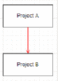

# NugetSampleProject
Porting .Net Framework packages to .Net Core and using them via Nuget

<!DOCTYPE HTML PUBLIC "-//W3C//DTD HTML 4.0 Transitional//EN">
<HTML>
<HEAD>	
</HEAD>
<BODY LANG="en-US" LINK="#0000ff" DIR="LTR">

<B>Nuget
</B>: is a free and open source
package manager designed for the Microsoft development platform.

<B>Steps
to port .Net framework project to .Net Core Nuget package</B>

Before
we start creating Nuget packages for .net framework projects to
different platforms. Let’s first discuss why do we have to do
this??

As we
all know .Net core is new web Framework, Microsoft has launched which
is platform independent. Which means .Net core apps developed can be
deployed and run on other platforms like MacOS, Linux, Windows etc. 

But In
our scenario, we are creating a new Project RAPI(Riskware API), which
will used as an API end-point to use our services. As we are building
this project in .Net core, we want our existing services to support
this project which .Net Framework centric. In order to achieve this
we need to convert our projects to .Net Standard or .Net Core, create
a Nuget package for this projects and use them in the projects that
requires these services.

<OL>
	<LI>
Right
	click on the project and unload the Project.

	<LI>
After
	unloading the project, Make following changes to the 
	&lt;Project&gt;.csproj file.

</OL>

<B>Change the below code</B>

&lt;Project
ToolsVersion=&quot;4.0&quot;
DefaultTargets=&quot;Build&quot;
xmlns=&quot;http://schemas.microsoft.com/developer/msbuild/2003&quot;&gt;

<B>To this </B>

&lt;Project Sdk=&quot;Microsoft.NET.Sdk&quot;
ToolsVersion=&quot;15.0&quot;&gt;

  

<B>Add
this code on the csproj file</B>

&lt;PropertyGroup&gt;
     

  
&lt;TargetFrameworks&gt;netstandard2.0;netcoreapp2.0;net461;&lt;/TargetFrameworks&gt;
   

   &lt;RuntimeIdentifiers&gt;win7-x86;win7-x64&lt;/RuntimeIdentifiers&gt;
                                                          

   &lt;Title&gt;Project
A Package&lt;/Title&gt;
   

   &lt;GeneratePackageOnBuild&gt;True&lt;/GeneratePackageOnBuild&gt;
   

   &lt;Version&gt;2.0.0&lt;/Version&gt;
   

   &lt;EnableDefaultCompileItems&gt;false&lt;/EnableDefaultCompileItems&gt;
 

 
&lt;/PropertyGroup&gt;

  

<TABLE WIDTH=623 CELLPADDING=7 CELLSPACING=0>
	<COL WIDTH=179>
	<COL WIDTH=415>
	<TR VALIGN=TOP>
		<TD WIDTH=179 STYLE="border: 1px solid #00000a; padding-top: 0in; padding-bottom: 0in; padding-left: 0.08in; padding-right: 0.08in">
			
PropertyGroup:

		</TD>
		<TD WIDTH=415 STYLE="border: 1px solid #00000a; padding-top: 0in; padding-bottom: 0in; padding-left: 0.08in; padding-right: 0.08in">
			
Contains a ser of user-defined
			property elements. Every property used in an MSBuild project must
			be a child of a PropertyGroup element.

		</TD>
	</TR>
	<TR VALIGN=TOP>
		<TD WIDTH=179 STYLE="border: 1px solid #00000a; padding-top: 0in; padding-bottom: 0in; padding-left: 0.08in; padding-right: 0.08in">
			
TargetFrameworks:

		</TD>
		<TD WIDTH=415 STYLE="border: 1px solid #00000a; padding-top: 0in; padding-bottom: 0in; padding-left: 0.08in; padding-right: 0.08in">
			
TargetFramework element specifies
			the API’s that you want to make your app available in.

		</TD>
	</TR>
	<TR VALIGN=TOP>
		<TD WIDTH=179 STYLE="border: 1px solid #00000a; padding-top: 0in; padding-bottom: 0in; padding-left: 0.08in; padding-right: 0.08in">
			
RuntimeIdentifiers:

		</TD>
		<TD WIDTH=415 STYLE="border: 1px solid #00000a; padding-top: 0in; padding-bottom: 0in; padding-left: 0.08in; padding-right: 0.08in">
			
RuntimeIdentifiers is used to
			identify target platforms where the application runs.

		</TD>
	</TR>
	<TR VALIGN=TOP>
		<TD WIDTH=179 STYLE="border: 1px solid #00000a; padding-top: 0in; padding-bottom: 0in; padding-left: 0.08in; padding-right: 0.08in">
			
Title:

		</TD>
		<TD WIDTH=415 STYLE="border: 1px solid #00000a; padding-top: 0in; padding-bottom: 0in; padding-left: 0.08in; padding-right: 0.08in">
			
Specify a name

		</TD>
	</TR>
	<TR VALIGN=TOP>
		<TD WIDTH=179 STYLE="border: 1px solid #00000a; padding-top: 0in; padding-bottom: 0in; padding-left: 0.08in; padding-right: 0.08in">
			
GeneratePackageOnBuild:

		</TD>
		<TD WIDTH=415 STYLE="border: 1px solid #00000a; padding-top: 0in; padding-bottom: 0in; padding-left: 0.08in; padding-right: 0.08in">
			
Create a Nuget package on build

		</TD>
	</TR>
	<TR VALIGN=TOP>
		<TD WIDTH=179 STYLE="border: 1px solid #00000a; padding-top: 0in; padding-bottom: 0in; padding-left: 0.08in; padding-right: 0.08in">
			
Version:

		</TD>
		<TD WIDTH=415 STYLE="border: 1px solid #00000a; padding-top: 0in; padding-bottom: 0in; padding-left: 0.08in; padding-right: 0.08in">
			
Version of the package

		</TD>
	</TR>
	<TR VALIGN=TOP>
		<TD WIDTH=179 STYLE="border: 1px solid #00000a; padding-top: 0in; padding-bottom: 0in; padding-left: 0.08in; padding-right: 0.08in">
			
EnableDefaultCompileItems:

		</TD>
		<TD WIDTH=415 STYLE="border: 1px solid #00000a; padding-top: 0in; padding-bottom: 0in; padding-left: 0.08in; padding-right: 0.08in">
			
If you
			have globs in your project and you try to build it using the new
			SDK, you will get an error.

			
 
			

			
To overcome this issue, set this
			property to false, which will override implicit inclusion and the
			behavior will revert back to the previous SDK where you had to
			specify the default globs in your project.

		</TD>
	</TR>
</TABLE>

  

<B>Note</B>:
Make necessary changes to the above code, for ex: if you have updated
you dll then you need to change the version, so that Nuget will have
a track of all the versions and user can choose which version he/she
wants to use.

<B>Note</B>:
Target framework should also include the .net framework on which it
was developed apart from .net core and .net standard.

<OL START=3>
	<LI>
Once
	you make those changes, Reload the project and rebuild it. 
	

	<LI>
This
	will generate the .dll files and Nuget package for this build in the
	Debug/Release folder of the project.

	<LI>
Before
	we proceed to deploy the package to the Remote Nuget Server, we need
	to test this project locally to make sure it works without any
	issues.

	<LI>
In
	order to test that, you need to copy the Nuget package to the &lt;Local
	Nuget&gt;.  
	

	<LI>
Now
	create a test project and install the Nuget package that is deployed
	in the &lt;Local Nuget&gt;.

	<LI>
If
	you have any issues installing the package or referencing the class
	properties or methods, fix the issues and re-test it.

	<LI>
If
	the installation and referencing the project classes its methods and
	properties are successful, now you can proceed to deploy it on the
	Nuget.Server (which is in the cloud). 
	

</OL>

  

<OL START=10>
	<LI>
To
	Deploy the Nuget package on to the cloud you need to run the
	following command 
	

</OL>
<TABLE WIDTH=575 CELLPADDING=7 CELLSPACING=0>
	<COL WIDTH=69>
	<COL WIDTH=476>
	<TR VALIGN=TOP>
		<TD WIDTH=69 STYLE="border: 1px solid #00000a; padding-top: 0in; padding-bottom: 0in; padding-left: 0.08in; padding-right: 0.08in">
			
Syntax:

		</TD>
		<TD WIDTH=476 STYLE="border: 1px solid #00000a; padding-top: 0in; padding-bottom: 0in; padding-left: 0.08in; padding-right: 0.08in">
			
nuget.exe
			push {package file} {apikey} -Source
			https://riskwarenugetserver.azurewebsites.net/nuget

		</TD>
	</TR>
	<TR VALIGN=TOP>
		<TD WIDTH=69 STYLE="border: 1px solid #00000a; padding-top: 0in; padding-bottom: 0in; padding-left: 0.08in; padding-right: 0.08in">
			
Example:

		</TD>
		<TD WIDTH=476 STYLE="border: 1px solid #00000a; padding-top: 0in; padding-bottom: 0in; padding-left: 0.08in; padding-right: 0.08in">
			
nuget.exe
			push S2.KeyReader.1.0.0.nupkg PanNugetDeploy123 -Source
			<A HREF="https://riskwarenugetserver.azurewebsites.net/nuget"><U>https://riskwarenugetserver.azurewebsites.net/nuget</U></A>

			
 
			

		</TD>
	</TR>
</TABLE>

  

<B>Note</B>:
If the version of the package is already deployed, you can re-upload
the same package, you either have to change the version of the
package and re-upload or else delete the package from the Nuget
Server.

<OL START=11>
	<LI>
Once
	you have deployed the package on to Nuget server, you can install
	the package in to your project by selecting the Package
	Source(Riskware Nuget Server) and installing the package.

	<LI>
 If
	you want to delete the package, you can run the following command 
	

</OL>
<TABLE WIDTH=623 CELLPADDING=7 CELLSPACING=0>
	<COL WIDTH=89>
	<COL WIDTH=505>
	<TR VALIGN=TOP>
		<TD WIDTH=89 STYLE="border: 1px solid #00000a; padding-top: 0in; padding-bottom: 0in; padding-left: 0.08in; padding-right: 0.08in">
			
Syntax:

		</TD>
		<TD WIDTH=505 STYLE="border: 1px solid #00000a; padding-top: 0in; padding-bottom: 0in; padding-left: 0.08in; padding-right: 0.08in">
			
nuget.exe
			delete {your_package_id} {version} -Source {feed URL} -ApiKey key

		</TD>
	</TR>
	<TR VALIGN=TOP>
		<TD WIDTH=89 STYLE="border: 1px solid #00000a; padding-top: 0in; padding-bottom: 0in; padding-left: 0.08in; padding-right: 0.08in">
			
Example:

		</TD>
		<TD WIDTH=505 STYLE="border: 1px solid #00000a; padding-top: 0in; padding-bottom: 0in; padding-left: 0.08in; padding-right: 0.08in">
			
nuget.exe delete S2.KeyReader 1.0.0
			-ApiKey PanNugetDeploy123 -Source
			<A HREF="https://riskwarenugetserver.azurewebsites.net/nuget"><U>https://riskwarenugetserver.azurewebsites.net/nuget</U></A>

			
 
			

		</TD>
	</TR>
</TABLE>

  

  

  

  

  

<B>Steps
to port .Net framework project with dependencies to .Net Core Nuget
package</B>

Before
we start implementing the steps to convert .net framework project
which has dependencies on other projects to a Nuget package which has
the .dll’s for required .net platforms. Let’s first discuss the
issue with this.

As we
all know most of the projects that we develop or are developed by
others are dependent on other projects for their implementation. This
is basically done as a part of separation of concern. So creating a
Nuget package for the target project would fail to install. This is
because we haven’t referenced its project dependencies and Nuget or
visual studio is neither smart enough to create Nuget dependency
references for the project.

To
resolve this issue, you need to create the Nuget package for
dependent projects that are linked to this project. Install the
dependent Nuget packages on the target project. Now create a Nuget
package for the target project. 

The
final Nuget package created for the target project can be deployed to
Nuget server and can be installed from the Nuget package manager. As
you can see the image below, <B>Project
A</B> project is dependent on
<B>Project B</B>.
So now let’s implement this through a sample project.

  

  

  

<OL>
	<LI>
First
	create a Nuget package for the <B>Project
	B</B> first, using the steps
	mentioned above.

	<LI>
Once
	you have created the package for <B>Project
	B</B>, add the Nuget project to
	the Local Nuget Server.

	<LI>
Now
	on the <B>Project A</B>,
	install the <B>Project B</B>
	Nuget package using the Nuget package manager. 
	

	<LI>
Create
	the Nuget package for <B>Project
	A</B>, add the Nuget project to
	the Local Nuget Server.

	<LI>
To
	this Nuget package, create .Net core console app project and install
	the <B>Project A</B>
	Nuget package and use the <B>Project
	B</B> services that are linked to
	<B>Project A</B>
	services.

</OL>

  

  

  

  

  

  

  

</BODY>
</HTML>
